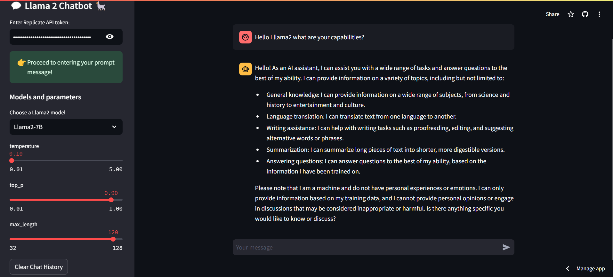
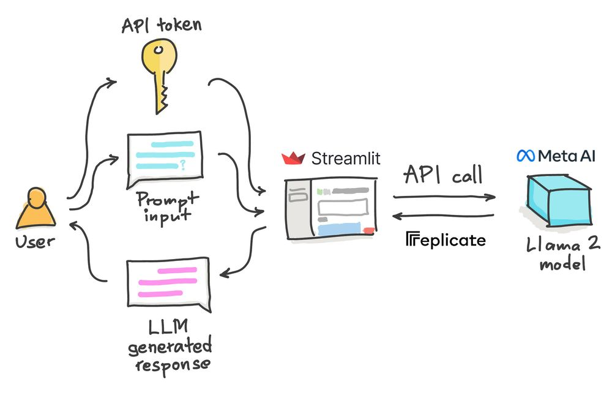

# Llama 2 Chat Application 🦙💬



In this project, we will build a **Llama 2 chatbot** in Python using **Streamlit** for the frontend, while leveraging the Llama 2 model hosted on **Replicate** for the backend.

---

## Table of Contents 📑
1. [Introduction](#introduction)
2. [What is Llama 2?](#what-is-llama-2)
3. [Key Features of Llama 2](#key-features-of-llama-2)
4. [App Overview](#app-overview)
5. [Getting Started](#getting-started)
   - [1. Get a Replicate API token](#1-get-a-replicate-api-token)
   - [2. Set up the coding environment](#2-set-up-the-coding-environment)
   - [3. Build the app](#3-build-the-app)
   - [4. Set the API token](#4-set-the-api-token)
   - [5. Deploy the app](#5-deploy-the-app)
6. [Try It Out](#try-it-out)
7. [Wrapping Up](#wrapping-up)
8. [References](#references)

---

## Introduction

This guide walks you through building a chatbot using **Llama 2**, an open-source large language model by Meta. Our app will have a **Streamlit** interface, and we’ll call the **Replicate API** to communicate with the Llama 2 backend for generating responses to user inputs.

---

## What is Llama 2?

**Llama 2** is Meta’s open-source language model, released on **July 18, 2023**. Meta has made the model free for research and commercial use while promoting transparent and responsible AI through their **Responsible Use Guide**.

### Key Features of Llama 2:
- **Performance**: Outperforms other open-source LLMs in reasoning, coding, and knowledge benchmarks.
- **Training Data**: Trained on **2 trillion tokens**, nearly double the data of version 1.
- **Human Annotations**: Includes over **1 million human annotations** for fine-tuning chat completions.
- **Model Sizes**: Available in three sizes: 7B, 13B, and 70B parameters.
- **Longer Context**: Supports up to **4096 tokens** for extended context understanding.
- **Commercial License**: Offers a more permissive license, allowing commercial use.

---

## App Overview 🛠️

The **Llama 2 Chat Application** allows users to interact with the Llama 2 model via a simple frontend. The key components are:
1. **User Input**: Users provide a Replicate API token and a message prompt.
2. **Backend**: The app makes API calls to Replicate, which processes the prompt and returns an AI-generated response.
3. **Response Display**: The chatbot displays the response in the app interface.



---

## Getting Started 🚀

Follow these steps to build your Llama 2 chat app:

### 1. Get a Replicate API Token
   - Visit [Replicate](https://replicate.com/) to create an account and obtain a free API token.

### 2. Set Up the Coding Environment
   - Ensure you have **Python** and **Streamlit** installed.
   - Install the necessary libraries by creating a `requirements.txt` file and running:
     ```bash
     pip install -r requirements.txt
     ```

### 3. Build the App
   - Write the Python code for your **Streamlit** app. The app will take inputs from the user (API token and prompt), send them to Replicate, and display the response.

### 4. Set the API Token
   - Add a section to your code to request the Replicate API token if not already provided.

### 5. Deploy the App
   - Use **Streamlit Cloud** or another hosting platform to deploy your app online.

---

## Try It Out 🧪

Ready to test the app? Follow these simple steps:

1. Visit the live app at: [Llama 2 Chat Assistance](https://llama2-chat-assistance.streamlit.app/)
2. Sign up for a free API key on [Replicate](https://replicate.com/).
3. Enter your Replicate API token when prompted by the app.
4. Type your prompt into the chatbox and enjoy the experience!


---

## Wrapping Up 🎉

Congratulations on building and trying out your **Llama 2 Chat Application**! Whether you're a developer or just curious, I hope you enjoyed this project. In this app, we used the **7B version** of Llama 2, and the model parameters (such as **temperature** and **top_p**) were set to arbitrary values.

Feel free to experiment with these settings to see how they affect the AI's responses. You can even upgrade to the **Pro version**, where you can specify the model and fine-tune parameters for deeper customization.

---

## References 📚

- [Streamlit](https://www.streamlit.io)
- [Llama 2 Chat App Tutorial](https://blog.streamlit.io/how-to-build-a-llama-2-chatbot/)
- [Replicate](https://www.replicate.com)
